# Software-Design-console-game
## TicTacToe with questions
Je kent allemaal wel het spel ticTacToe ook wel bekend boter-kaas-en-eieren, waarbij het doel is om 3 op een rij te krijgen.
Om een twist aan het spel te geven hebben wij vragen aan toegevoegd die je correct moet beantwoorden, waarna je jouw teken mag plaatsen.
Dit zorgt ervoor dat je niet alleen kennis moet hebben over boter-kaas-en-eieren, maar ook nog algemene kennis, wat de potjes toch net wat interessanter maakt.

## De samenwerking
### Hoe ging de samenwerking
We hebben besloten om te pair programmen om beide een duidelijke blik te houden over het hele project. 
Ook konden we hierdoor alles makkelijker integreren omdat we beide wisten hoe het programma werkte, in plaats van dat we beide andere delen van de applicatie hebben gemaakt.
We spraken iedere dag af om te pair programmen en wisselde iedere dag om waardoor we beide evenveel aan het project hebben gewerkt.

### Commits (update readme excluded):
- Erik (6) + initial commit
- Robin (7)

### Planning
9-1-2024 Initial commit 10-1-2024 Erik programmed & Robin pair programmed | Questions types gemaakt 
11-1-2024 Robin programmed & Erik pair programmed | Question Factories gemaakt 
12-1-2024 Erik programmed & Robin pair programmed | Board builder gemaakt 
13-1-2024 Robin programmed & Erik pair programmed | State design pattern gemaakt 
14-1-2024 Erik programmed & Robin pair programmed | players place symbol and renders it correctly, and fixed some bugs  
15-1-2024 Robin programmed & Erik pair programmed | Added questions and base game loop 
16-1-2024 Erik programmed & Robin pair programmed | Added checkQuestions facade & finished the game 

## Uitleg design patterns:
### Builder:
Om boter-kaas-en-eieren te kunnen spelen heb je een bord nodig, hiervoor gebruiken we een gridBuilder.
Deze gridBuilder is verantwoordelijk voor het maken van de verschillende onderdelen van de grid.
De gridBuilder implementeert de gridBuilderInterface zodat deze weet welke methods hij nodig heeft.
Dan is er nog de gridDirector, deze roept de functies van de gridBuilder in de goede volgorde aan en zorgt er daarmee voor dat de grid juist gebouwt wordt.
Dit doet de gridDirector op basis van de array met daarin alle info over het bord.
Het bord wordt elke ronde opnieuw gemaakt in de Turn klasse waar we in de state design pattern nog meer over gaan uitleggen.

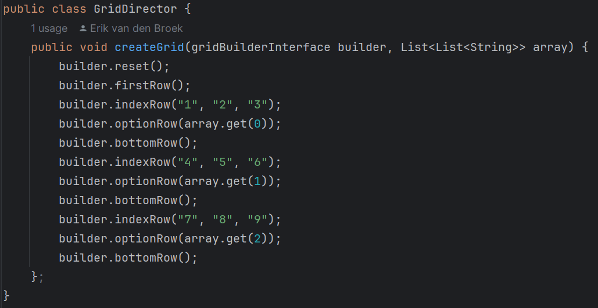 
Hier is te zien hoe de gridDirector het bord opbouwt met en de gegevens meegeeft om het juiste teken in het juiste vakje te zetten. 
 
**Voorbeeld** 
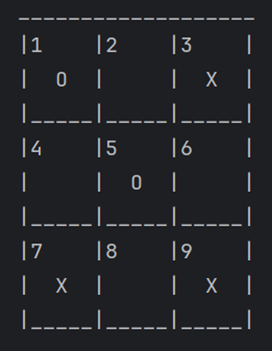 
### Factory
In ons boter-kaas-en-eieren spel heb je ook vragen die je iedere ronde beantwoord. 
Er zijn 3 verschillende soorten vragen: true / false, multiple choice en open vragen.
De question interface zorgt ervoor dat alle type vragen gemaakt en nagekeken kunnen worden, maar ze dit op hun eigen manier kunnen implementeren. 
 
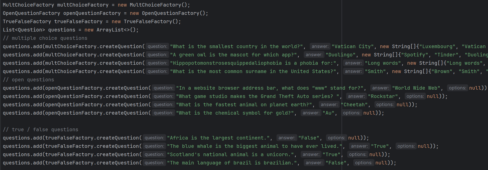 
Hierboven is te zien hoe alle vragen worden aangemaakt en in de vragenlijst worden gezet. 
Er zijn drie verschillende factories een voor elk type vraag deze maken een nieuwe vraag aan met de meegegeven gegevens. 
Vervolgens geeft hij de gemaakte vraag terug, die je later kunt nakijken als er een antwoord is geven.  
 
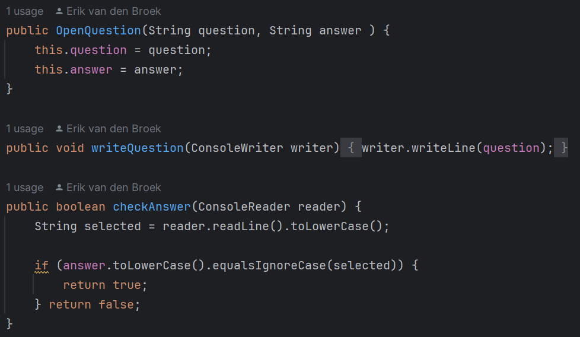 
In dit voorbeeld kun je zien hoe een open vraag wordt geschreven en gecontroleerd. 

**Voorbeelden** 
true / false question:  
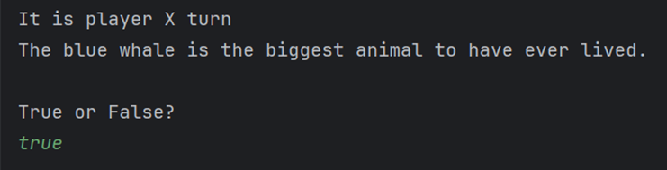 
 
Open Question:  
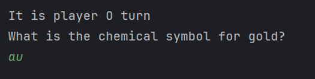 
 
Multiple choice question:  
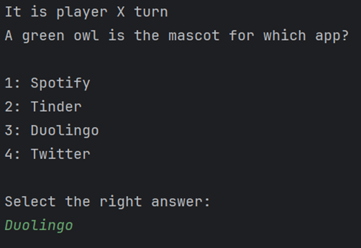 
### State
Om na elke beurt te wisselen van speler maken we gebruik van het state design pattern, 
deze zorgt ervoor dat de state aan het einde van elke beurt verandert om de beurt door te geven aan de volgende persoon.
Door middel van het state design pattern kunnen we het teken van de speler die aan zet is toevoegen aan het bord.
Ook kunnen we hiermee aan het einde van de ronde controleren of de speler aan zet gewonnen heeft. 

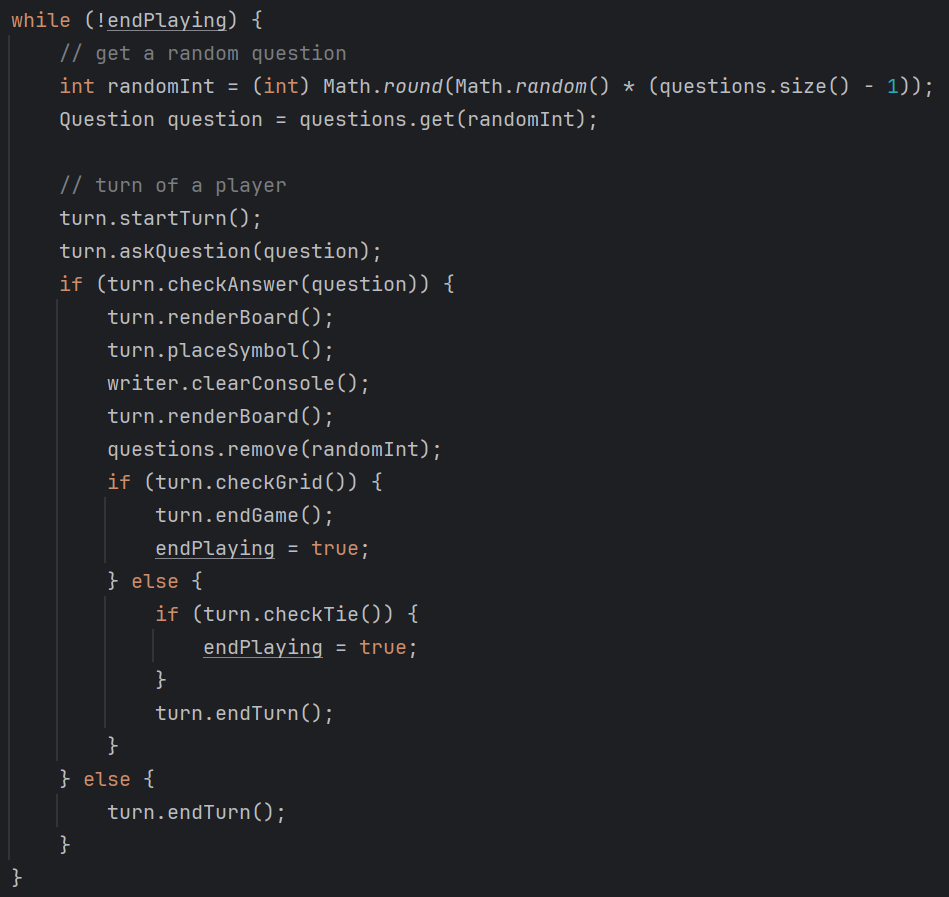 
Iedere ronde ziet er als volgt uit voor de speler aan zet:
1. Groet de speler
2. Stel een vraag aan de speler
3. Controleren we het antwoord (indien fout eindigt de beurt)
4. Teken we het bord zodat de speler kan kiezen waar deze zijn/haar teken wil zetten
5. Vraag in welk vak de speler zijn/haar teken wil zetten
6. Teken nogmaals het bord om te laten zien dat het teken geplaatst is
7. Controleer of de speler drie op een rij heeft (indien geen drie op een rij eindigt de beurt)
8. Feliciteer speler dat hij/zij drie op een rij heeft en eindig het spel
    
    
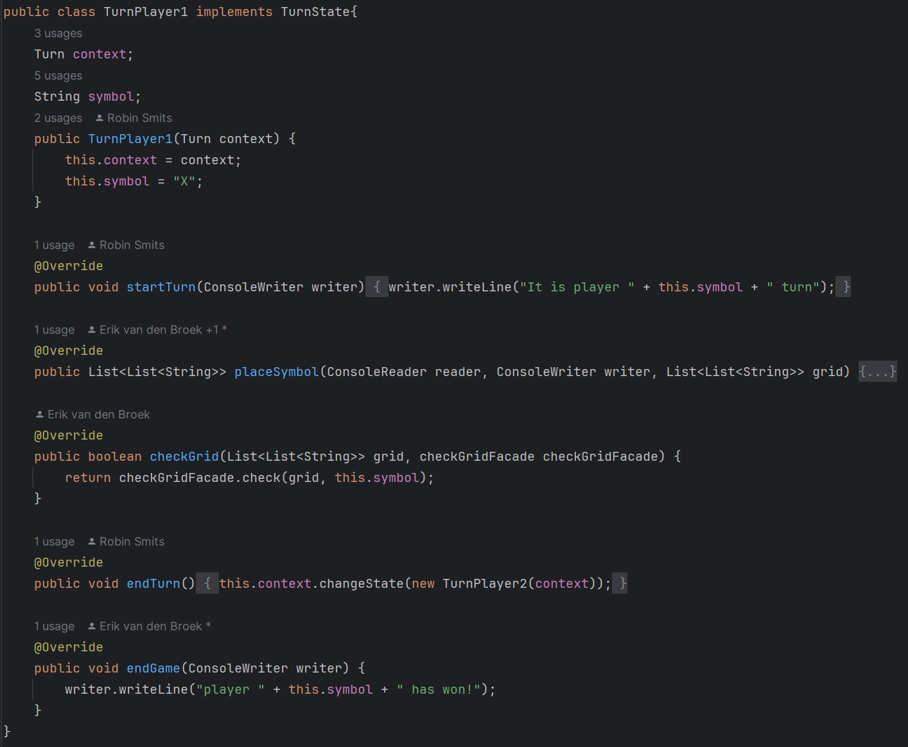 
Dit van een van onze states, deze laat zien hoe de methodes voor speler 1 worden geïmplementeerd. 
    
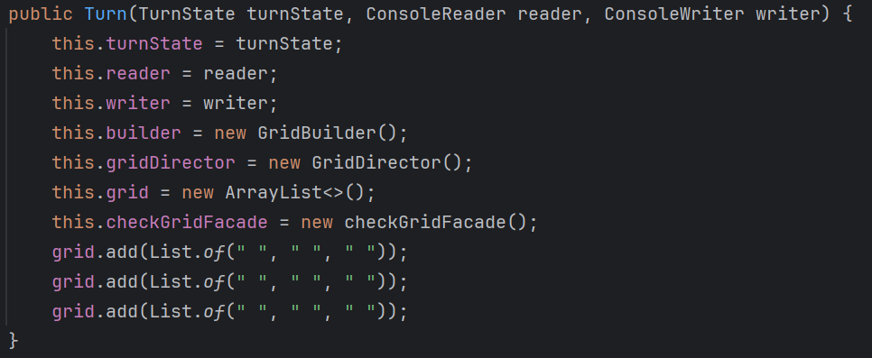 
De turn class houdt bij in welke staat deze is, houdt updates van de grid bij.
### Facade
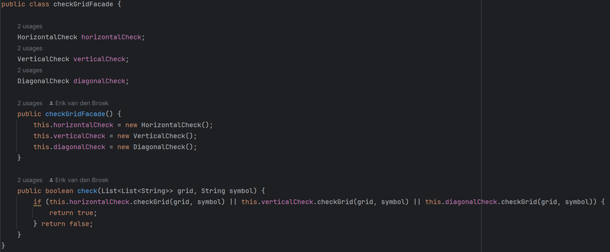 
De checkGridFacade zorgt ervoor dat je met een check functie in alle richting kunt controlleren of een speler drie op een rij heeft. 
 
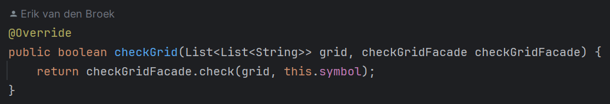 
Hier is te zien hoe we door middel van een functie kijken of een specifiek symbool drie op een rij heeft.
Als een speler drie op een rij heeft, wordt dit terug gegeven en het spel beëindigt. 
 
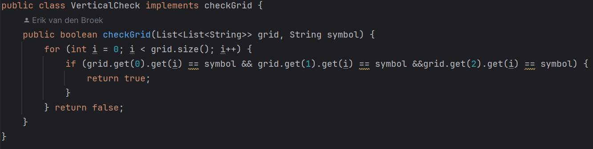 
In de verticalCheck loopen we door de x positie op drie vaste y coördinaten,
hierbij kijken we of de symbolen op deze coördinaten allemaal gelijk zijn aan het meegegeven symbool.
Als alle als de symbolen op deze drie x coördinaten gelijk zijn aan het meegegeven symbool geven we terug dat de speler drie op een rij heeft en dus gewonnen.

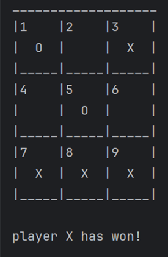
